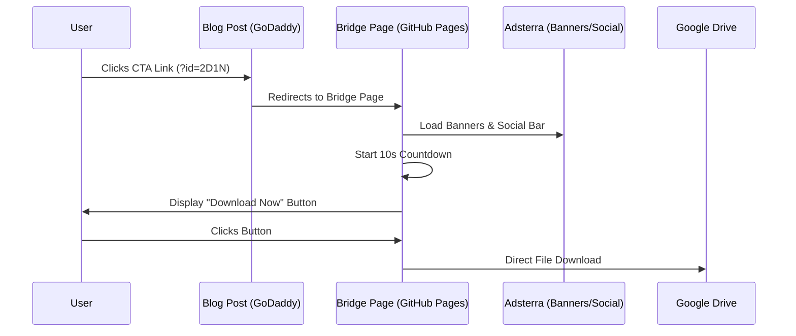

# **Architecture Overview: Dynamic Ad-Monetized Download System**

This document outlines the technical architecture for the "Dynamic Bridge Page" strategy implemented on a restricted platform (GoDaddy Website Builder).

## **1. High-Level Logic Flow**

The system follows a 3-step sequence to ensure monetization before the user receives the final asset.

1. **Entry Point (Blog):** User visits a content-rich blog post (e.g., Mt. Negron) and clicks a call-to-action link containing a unique identifier (`?id=2D1N`).  
2. **The Bridge (GitHub Pages):** The browser loads the standalone bridge page hosted on GitHub. While the user waits for a 10s countdown, **Passive Ad Banners** and **Social Bars** are displayed to generate revenue.  
3. **Direct Delivery (Google Drive):** Upon countdown completion, a "Download Now" button appears. When clicked, it triggers a direct download from Google Drive in a new tab.

## **2. System Flow Diagram**

| Component | Role | Technology/Service |
| :---- | :---- | :---- |
| **Content Host (Blog)** | Hosts the blog articles and traffic source. | GoDaddy Website Builder |
| **Bridge Host** | Hosts the standalone bridge page to bypass sandboxes. | GitHub Pages |
| **Logic Engine** | Detects URL parameters and maps them to files. | Vanilla JavaScript |
| **Monetization** | Provides passive revenue during the countdown. | Adsterra (Banners & Social Bar) |
| **File Storage** | Hosts the actual PDF/Zip assets. | Google Drive (Direct Link) |

## **3\. Data Flow Architecture**

The "Brain" of the system is the fileDatabase object. This maps short keys to complex URLs.

const fileDatabase = {  
    '2D1N': {  
        title: 'Mt. Negron 2D1N - Itinerary',  
        fileUrl: 'https://drive.google.com/uc?export=download&id=...'
    },
    '3D2N': {  
        title: 'Mt. Negron 3D2N - Itinerary',  
        fileUrl: 'https://drive.google.com/uc?export=download&id=...'
    }
}

## **4\. Security & Technical Workarounds**

### **Bypassing GoDaddy Iframe Restrictions**

GoDaddy's "Custom Code" block is restricted by a strict `sandbox` attribute that blocks direct downloads and certain scripts. The architecture solves this by:

1. **External Hosting:** Moving the bridge page to GitHub Pages to run as a top-level document.
2. **Top-Level Navigation:** Using a direct `<a>` tag with `target="_blank"` or direct file URL to ensure the browser handles the download outside of any iframe context.
3. **URL Parameter Passthrough:** Ensuring the blog CTA link points directly to the GitHub Pages URL with the required `?id=` parameter.

### **Case-Neutral Mapping**

To prevent broken links due to user typing or copy-paste errors, the architecture forces all incoming IDs to **Uppercase** and trims whitespace before comparing them to the database.

## **5. Visual Data Journey**

User -> Blog CTA (?id=...) -> GitHub Bridge Page -> 10s Countdown (+ Ads) -> "Download Now" Button -> Google Drive Download

## **6. Error Handling & Edge Cases**

*   **Invalid ID:** If the `id` parameter is missing or doesn't match a key in `fileDatabase`, the UI displays a clear "File Not Found" error message with instructions to check the link.
*   **Case Sensitivity:** All incoming IDs are automatically converted to uppercase to ensure reliability regardless of how the URL is typed.

## **7. Maintenance & Scaling**

To add a new downloadable asset:
1.  Upload the file to Google Drive and generate a direct download link (`uc?export=download&id=...`).
2.  Add a new entry to the `fileDatabase` object in `Download_Page.html`.
3.  Update the blog post CTA link to use the new key (e.g., `?id=NEW_KEY`).